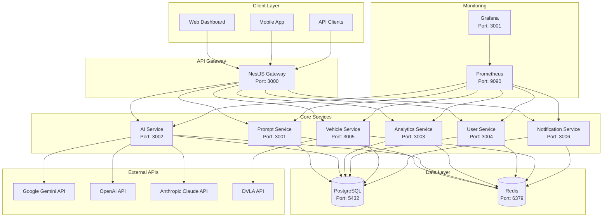
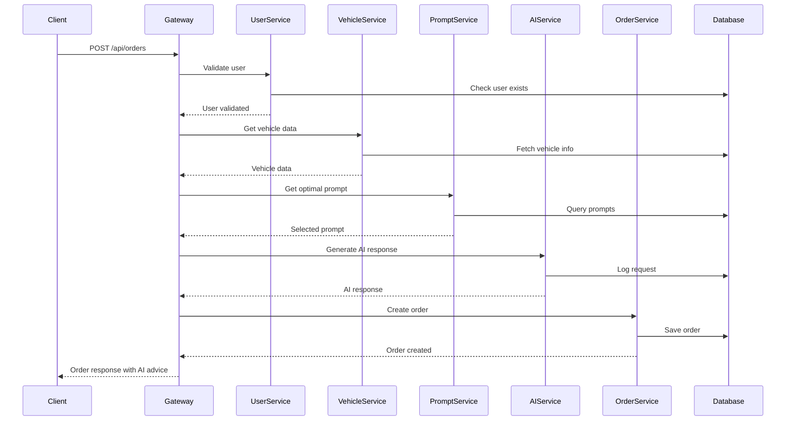
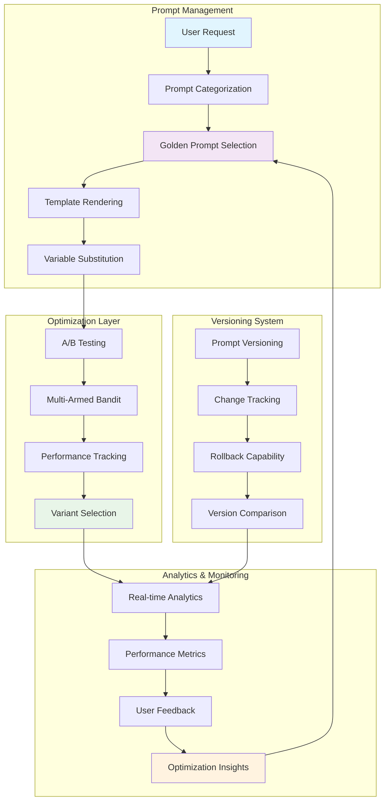
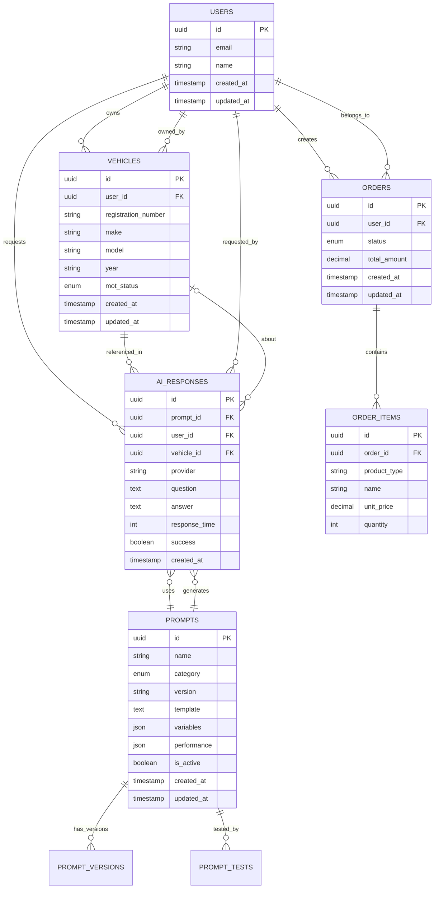
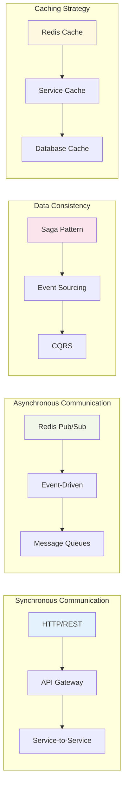
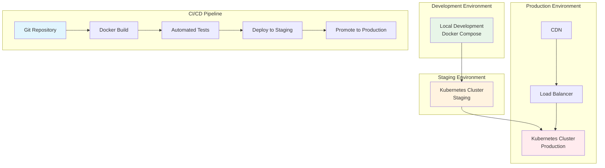

# DriveEver Microservices Architecture Diagrams

This document contains Mermaid diagrams showing the system architecture and data flow for the DriveEver AI platform.

## System Architecture Overview

## Order Creation Flow

## Golden Prompt Library Data Flow

## Database Schema Relationships

## Service Communication Patterns

## Security Architecture

```mermaid
graph TB
    subgraph "Authentication & Authorization"
        A[JWT Tokens] --> B[OAuth 2.0]
        B --> C[Role-Based Access]
    end

    subgraph "Input Validation"
        D[Request Validation] --> E[SQL Injection Prevention]
        E --> F[XSS Protection]
    end

    subgraph "Output Sanitization"
        G[Response Sanitization] --> H[Data Masking]
        H --> I[Audit Logging]
    end

    subgraph "Network Security"
        J[HTTPS/TLS] --> K[API Rate Limiting]
        K --> L[Firewall Rules]
    end

    style A fill:#ffebee
    style D fill:#e8f5e8
    style G fill:#e1f5fe
    style J fill:#fff3e0
```

## Deployment Architecture

